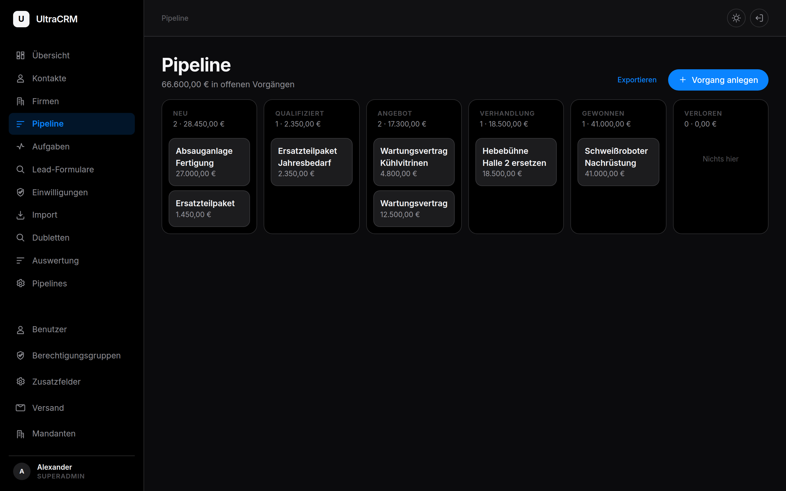
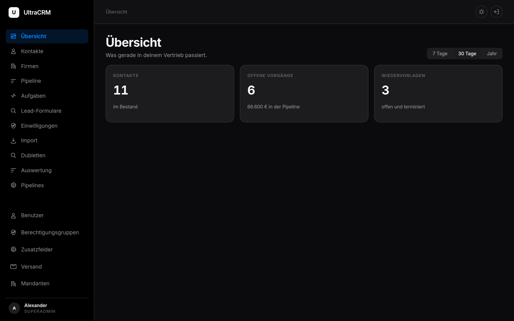
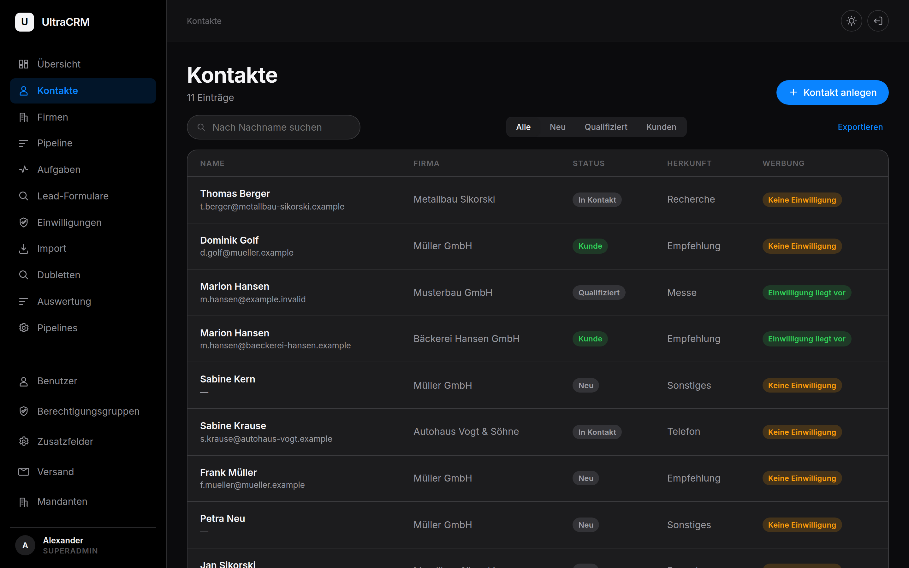
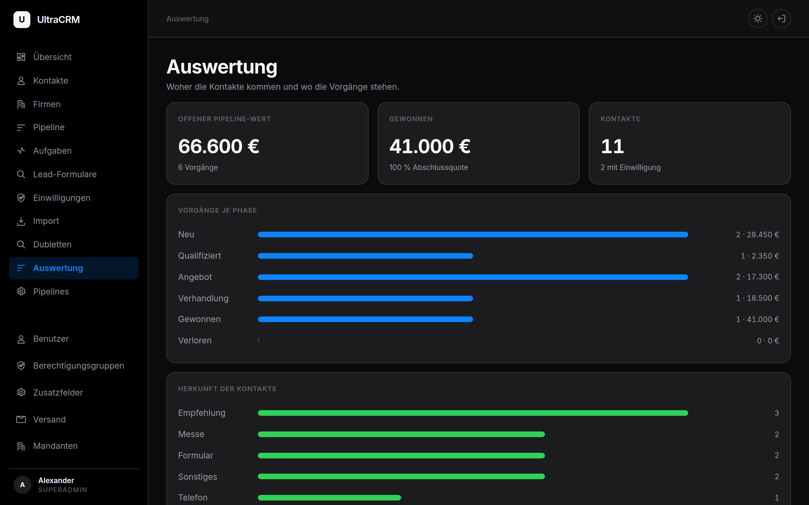
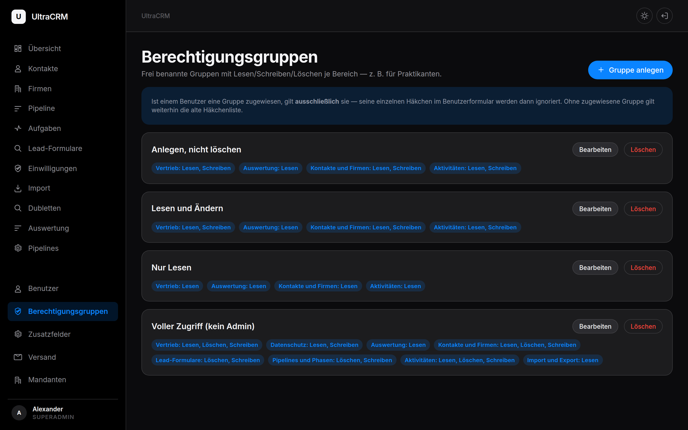
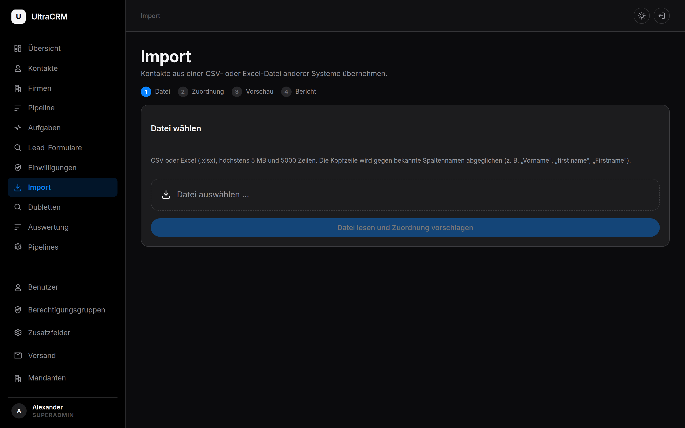
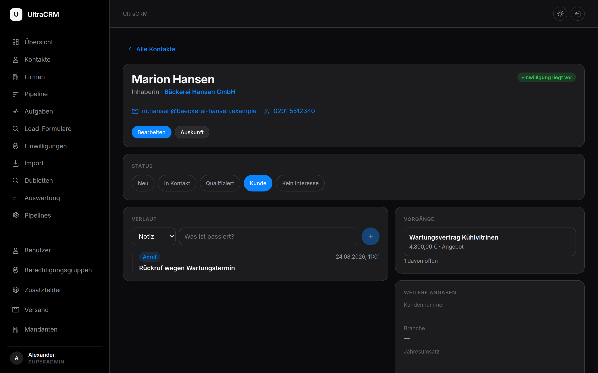
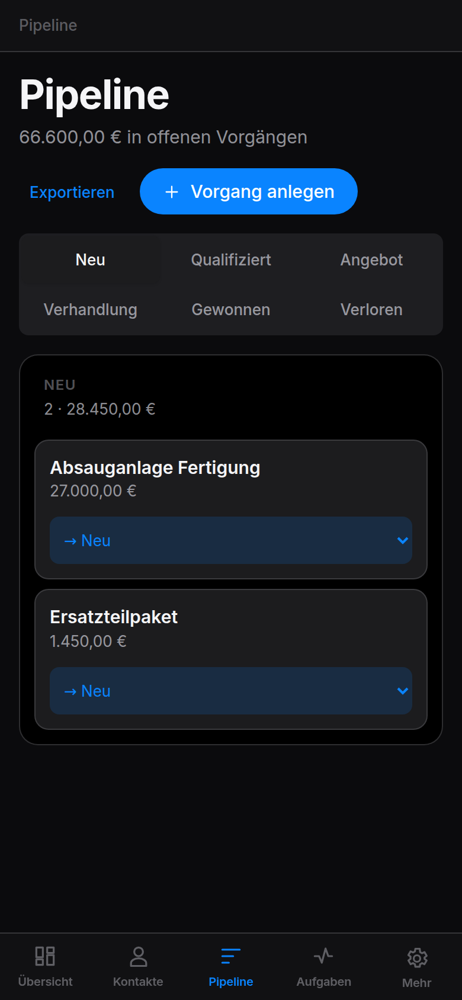
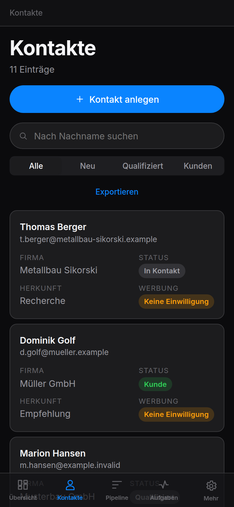

# UltraCRM

A multi-tenant CRM for sales teams and lead generation — German-language UI,
GDPR-oriented, self-hosted.

**Backend:** Symfony 8 · API Platform 4 · MySQL · JWT
**Frontend:** Vue 3 · Vite · Pinia
**Tests:** 145 (47 unit, 98 integration against a real database)



---

## What it does

| | |
|---|---|
| **Contacts & companies** | People with position and department, linked to companies, one designated primary contact per company |
| **Sales pipeline** | Freely configurable pipelines and stages per tenant, drag-and-drop board, forecast |
| **Activities** | Calls, notes, tasks with due dates and a follow-up list |
| **Lead capture** | Public form endpoint with double opt-in, honeypot and rate limiting |
| **GDPR** | Consent tracking with wording and timestamp, right-of-access export, erasure with audit trail, deletion schedule |
| **Duplicates** | Detection by email or by name within the same company, merge that never overwrites maintained data |
| **Import / export** | CSV and XLSX, column auto-detection, match against existing records before importing |
| **Custom fields** | Per-tenant field definitions for contacts, companies and deals, validated server-side |
| **Permissions** | Freely named permission groups with read/write/delete per area |
| **Audit trail** | Who changed which field, and when — excluding secrets |
| **Mail** | Per-tenant SMTP or Mailjet configuration with a test button |

## Screenshots

| Overview | Contacts |
|---|---|
|  |  |

| Reporting | Permission groups |
|---|---|
|  |  |

| Import with duplicate matching | Contact record |
|---|---|
|  |  |

The UI is built for phones as well:

<p>
  
  
</p>

## API examples

Everything the UI does is available over the REST API.

```bash
# Log in
TOKEN=$(curl -s -X POST https://your-crm/api/login \
  -H 'Content-Type: application/json' \
  -d '{"username":"you","password":"secret"}' | jq -r .token)

# Create a contact
curl -X POST https://your-crm/api/contacts \
  -H "Authorization: Bearer $TOKEN" \
  -H 'Content-Type: application/ld+json' \
  -d '{"firstName":"Marion","lastName":"Hansen","email":"m.hansen@example.com","source":"messe"}'

# Move a deal to another stage
curl -X PATCH https://your-crm/api/deals/12 \
  -H "Authorization: Bearer $TOKEN" \
  -H 'Content-Type: application/merge-patch+json' \
  -d '{"stage":"/api/stages/5"}'

# Public lead form — no authentication, the token identifies the tenant
curl -X POST https://your-crm/api/public/leads \
  -H 'Content-Type: application/json' \
  -d '{"token":"<form token>","lastName":"Lead","email":"lead@example.com","consent":true}'
```

Interactive documentation lives at `/api/docs`.

## Three rules the code keeps

Each of these is here because it was learned the hard way.

**1. Tenant isolation is verified, never assumed.**
A Doctrine filter constrains every tenant-owned entity and defaults to closed.
But it is switched off for superadmins, and `User` is deliberately exempt —
otherwise it would lock out the login itself. Wherever a rule has an
exception, something else has to take its place: an explicit check for
references between records, a query extension for user lookups.

**2. Every API resource declares its security.**
A missing `security:` attribute looks like "nothing special needed" and is an
open door. Rights follow the *effect*, not the name: anything that deletes
requires the delete permission for its area, no matter what the endpoint is
called. In hand-written controllers `#[IsGranted]` is not evaluated —
`denyAccessUnlessGranted()` belongs in the method body.

**3. Safety mechanisms fail in the safe direction.**
A contact without confirmed consent is not contactable. A withdrawal always
wins. An unknown stage type counts as *open*, not as closed. Fields that
together form one safety mechanism are never copied individually.

## Getting started

```bash
# Backend
cd api
composer install
cp .env .env.local          # set DATABASE_URL, APP_SECRET, JWT_PASSPHRASE
php bin/console lexik:jwt:generate-keypair
php bin/console doctrine:schema:create

# Frontend
cd ../frontend
npm install
npm run build               # or: npm run dev
```

Serve `frontend/dist` as the document root and route `/api` to
`api/public/index.php`.

### Tests

```bash
cd api
mysql -e "CREATE DATABASE crm_test CHARACTER SET utf8mb4"
# .env.test.local: DATABASE_URL with database name "crm" (Doctrine appends "_test"),
# plus JWT_PASSPHRASE
APP_ENV=test php bin/console doctrine:schema:create
vendor/bin/phpunit
```

The integration tests send real requests through the kernel — routing,
security, serializer and the tenant filter all behave exactly as in
production. They truncate every table between cases and refuse to run unless
the database name ends in `_test`.

### Maintenance commands

```bash
php bin/console app:phasen:nachziehen     # backfill pipelines/stages after an upgrade
php bin/console app:gruppen:vorlagen      # create the default permission groups
```

## Deployment notes

Clearing the cache is not enough — PHP-FPM has to be reloaded, otherwise
OPcache keeps serving the old classes:

```bash
php bin/console cache:clear --env=prod && systemctl reload php8.5-fpm
```

Never suppress the output of `cache:clear`. A fatal error in there stays
invisible and the application silently keeps running on the old cache.

## License

GNU Affero General Public License v3.0 — see [LICENSE](LICENSE).

Anyone who runs a modified version of this software as a network service has
to make its source available to the users of that service.
